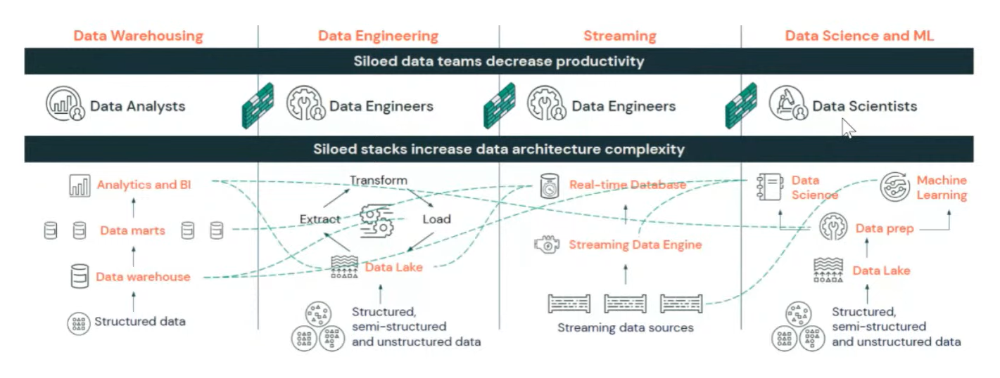
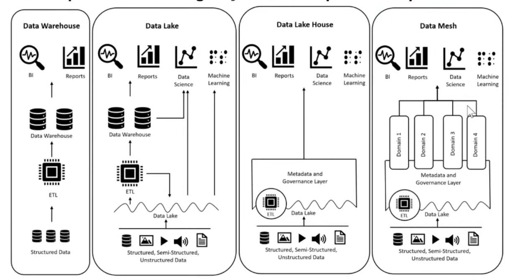
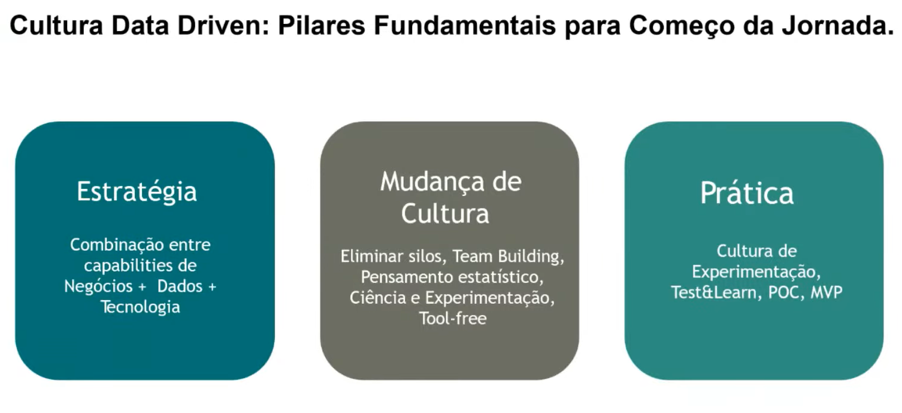
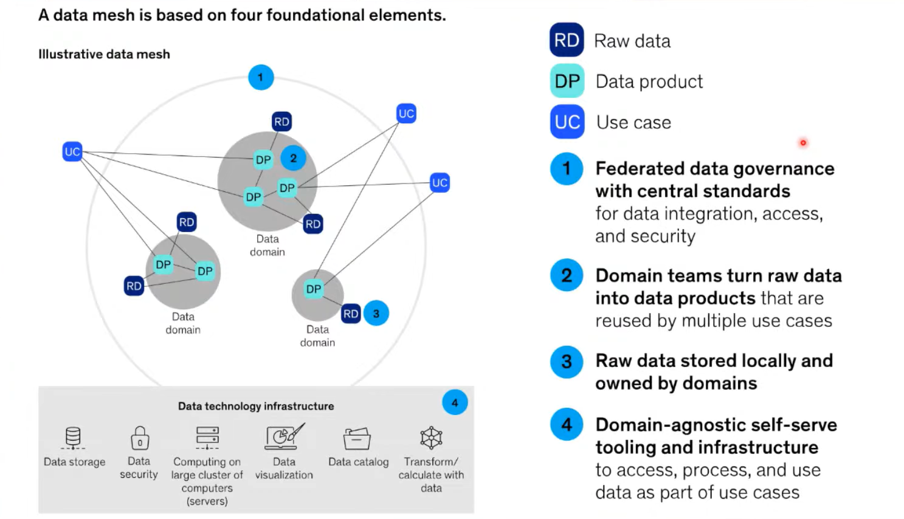
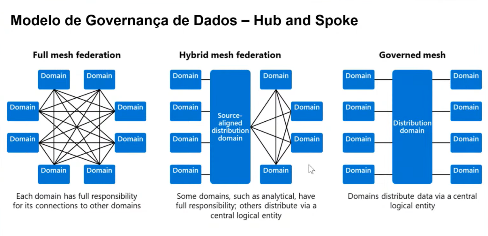
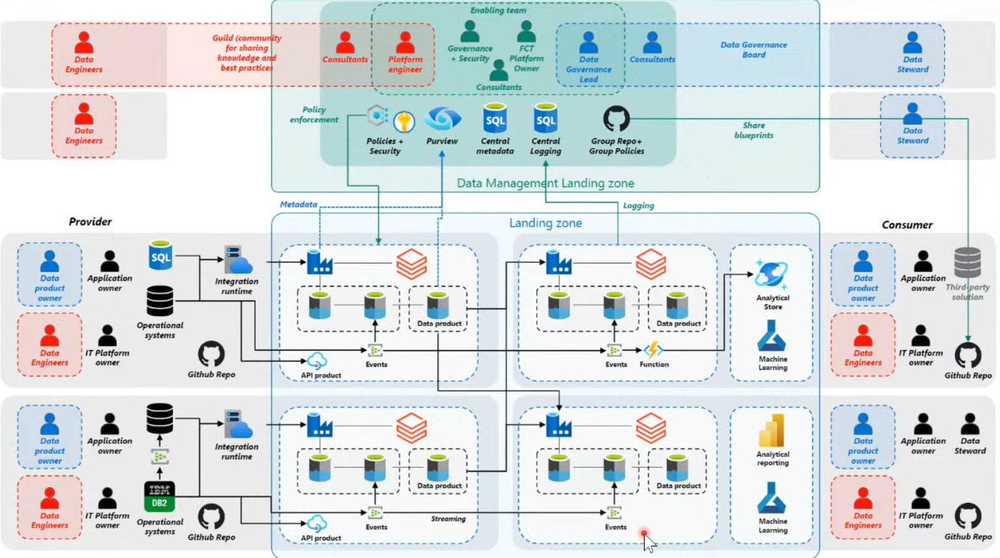
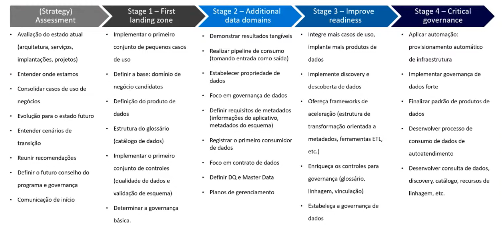
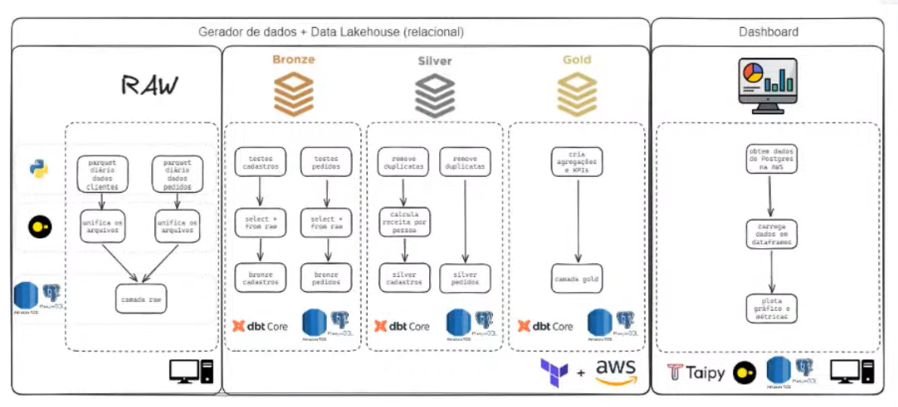

# Data Mesh | AWS | Duckdb | Taipy | dbt-core

-----

## 📋 Sobre

Construção de lakehouse.

Projeto de melhoria de plataforma de engenharia e IA para empresas.

## 📋 Problemas

O real cenário de muitas empresas é a **Ausência de Maturidade & Cenário Corporativo nas Empresas**, silos e feudos de dados departamentais, risco regulatório de vazamentos, ausência latente de governança e visibilidade de dados.

Com a desorganização dos **silos** de dados, a 1º ação necessária e padronizar e para isso primeiro devemos saber como cada estratégia funciona:

**Data Warehouse X Data Lakes x Data Lakehouses x Data Mesh**
*Diferenças, benefícios e oportunidades de geração de valor para as empresas.*

-----

**Data Warehouse**

Um DW é baseado em una estrutura de ETL, onde é criado ambientes apartados do banco de dados transacional com foco principal na extração e modelagem dessas informações para B.I e Reporting.
Isso significa que é muito difícil fazer ciência de dados em um ambiente DW, ou seja, esse ambiente é muito mais aderente a iniciativas tradicionais de B.I, não é um ambiente que propicia análises **ad-hoc** (Análise feita **sob demanda**, para responder perguntas específicas).

**Data Lake**

Diferente do DW, o Data Lake trás toda a massa de dados para um ambiente de dados distribuido, onde você passa de apenas analisar dados estruturados, para dados **Structured, Semi-Structured and Unstructured Data**, semelhantes ao **Data LakeHouse** e **Data Mesh**.
Outra caracteristica, é que qualquer tipo de arquivo pode entrar no seu banco de dados, CSV, PARQUET, JSON, PNG e etc, além de que o valor de um Data Lake é mais atraente que o de um DW.
Como um Data Lake possui uma grande variedade de formas para armazenar os dados, ele já possibilita atender áreas de ML e Data Science. Sendo assim, um ponto forte para Machine learning, Predictive analytics, ad-hock e Data mining

**Data Lake House**

Um **Lakehouse** já entra com a mesma capacidade de dados que um **Data Lake** e também conseguindo atender as mesmas áreas (B.I, Reports, Data Science, ML). Mas o diferencial de um Lakehouse, é suas camadas de **Medatada** e **Governança de Dados**, que não necessáriamente é uma técnologia, e sim uma estratégia. Esse modo de estratégia foi implementada pela **Databricks**.

**Data Mesh**

Já o **Data Mesh** que é o assunto abordado aqui, possui as mesmas capacidades que um Lakehouse, mas a sua diferença são os **Dominios**, que são praticamente uma separação para as especificas áreas de negócio.

**Observação**

*Tudo isso, não quer dizer que o Data Mesh é a melhor versão de todos os tipos e estratégias de dados, mas que sim é uma ferramenta/modo a mais para ser*
*considerado.*
*O que queremos aqui é decidir de acordo com as nossas necessidades e da necessidade da empresa, qual é o melhor método/tecnologia para ser usada ?.*

-----

#### Casos de Uso de Data Mesh

Data Silos é denominados quando existem diversos ambientes de dados separados entre as áreas de negocios de uma empresa, é onde o Data Mesh entra e organiza os Data Silos em **Use-case-especific**.

-----

#### Ecossistema de Contrato de Dados

Quando temos um problema de formas de consumir ou tratar um dado, temos duas partes interessantes:

**Federated Governance**

No ecossistema do Contrato de Dados, a estratégia de Federated Governance se resume a garantia da padronização da politica de dados na empresa,
onde você tem a garantia dessa aplicação de politicas toda vez que for trocar/modificar algo.

**Self-serve Data Platform**

Já na estratégia de Self-serve se constite na criação de padronização, componentes e aceleradores para fazer lançamentos de novos **use-cases**.

-----

***A data mesh is based on four foundational elements.***

1. Federação de dados, com centralização de padrões, com foco em integração de dados, acesso e segurança.
2. Times de domínios de negócios que transformar dados em produtos de dados
3. Base de dados pura, para cada domínio
4. Agnóstico de dominio, onde decidiremos quais componentes iremos habilitar neles. 

---

***Modelo de Governança de Dados - Hub and Spoke***

- **Full mesh federation**
Os domínios devem se conversar entre si, respeitando as politicas internas. Onde cada um tem a sua responsabilidade e implementações mais rápidas.

- ***Hybrid mesh federetion***
Modelo de atuação hibrido, onde dominios q consomem de um dominio principal, e também onde outros dominios consumerem, precisam passar por esse principal. Uma junção de Governed mesh e Full mesh federation.

- ***Governed mesh***
Sistema de distribuição, onde temos uma infraestrutura central onde os dados são distribuidos dentro desse ambiente. O principal dessa estrutura, é a governança, garantindo maior **Data quality**

**Arquitetura Empresarial**

-----
#### Como começar com o Data Mesh
***Normalmente empresas começam pequeno e escalam com necessidades***

----

# Dando Inicio ao Projeto

----

#### Anotando o Passo-a-Passo

##### Configurando Ambiente Virtual com UV

**Instalação da biblioteca UV**
    pip install uv
A biblioteca UV é um gerador de pacotes e ambientes virtuais para Python.
Ele foi feito para ser extremamente rápido e substituir ferramentas como:
* pip
* venv
* pip-tools
* poetry

**O que o UV faz?**

***Instala dependências***
    uv pip install pandas
É muito mais rápido que o pip tradicional porque ele é escrito em **Rust**

***Cria e gerencia ambientes virtuais***
    uv venv
Isso cria um ambiente virtual automaticamente

***Resolve dependências de forma determinística***
Ele gera um arquivo lock (tipo o poetry.lock) garantindo que todo mundo do time instale exatamente as mesmas versões.

---

1. Criando o Ambiente de Projeto

Na área de trabalho, utilizando o Bash:

- Instale o uv
    pip install uv
- Inicie o ambiente, esse comando vai criar uma pasta
    uv init caminho_da_pasta/nome_da_pasta
- Vá até a pasta
    cd caminho_da_pasta/nome_da_pasta
- Abre o vscode pelo terminal, na pasta referenciada
    code .
- Cria o ambiente virtual
    uv venv
- Para ativar a uv venv
    .venv\Scripts\activate
- instalando dependências do projeto
    uv add taipy polars faker python-dotenv duckdb dbt-core dbt-postgres psycopg2 matplotlib seaborn plotly

-----

**Observações**

Ele já cria alguns arquivos automaticamente (.gitignore, .git, .python-version, main.py, pyproject.toml e README.md)

Pode acontecer do interpretador do python estar apontando para o python errado, para listar o "pythons" rode:
    uv run where python
Para selecionar o interpretador correto faça o passo-a-passo:
1. Ctrl + Shift+ P
2. Digite: Python: Select interpreter
3. Escolha o que aponta para a sua venv, geralmente (./.venv/)

----

#### Criando um gerador de dados

generate_dataset\generate_raw.py

Evoluir isso:
Trocar todos os prints por uma biblioteca de log, salvar em algum lugar